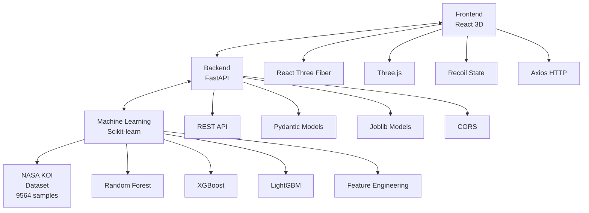

# 🌌 Exoplanet AI Discovery Platform

**An Epic AI-Powered 3D Exoplanet Discovery Platform**

[](https://reactjs.org/)
[](https://threejs.org/)
[](https://fastapi.tiangolo.com/)
[](https://python.org/)
[](https://scikit-learn.org/)

## 🚀 Project Overview

**Exoplanet AI Discovery Platform** is a revolutionary AI-driven 3D visualization platform that combines machine learning, space exploration, and immersive user experiences. The platform utilizes NASA's Kepler Space Telescope data to train advanced AI models for identifying and classifying exoplanets, then visualizes them in a spectacular 3D cosmic environment.

### 🌟 Key Features

- **🤖 AI-Powered Prediction**: Multi-algorithm approach (Random Forest, XGBoost, LightGBM, Gradient Boosting, Logistic Regression) for exoplanet classification
- **🌌 Immersive 3D Universe**: Epic 3D visualization built on React Three Fiber with particle systems, dynamic lighting, and realistic planetary effects
- **🎯 Smart Camera System**: Click-to-teleport planets, automatic camera focusing on AI-discovered planets
- **📊 Real-time Data Visualization**: Live planetary statistics, prediction results, and habitability assessments
- **🎮 Interactive Exploration**: Users can input parameters for AI predictions and observe results in 3D space

## 🏗️ Technical Architecture



## 📋 Feature Highlights

### 🤖 AI Machine Learning System
- **Multi-Model Ensemble**: 5 different algorithms for robust predictions
- **Feature Engineering**: Automated missing value handling, categorical encoding, habitability zone creation
- **Model Evaluation**: 92.16% accuracy with classification reports and feature importance analysis
- **Real-time Prediction**: Instant classification based on user-input planetary parameters

### 🌌 3D Cosmic Visualization
- **Realistic Planetary Effects**: Solar system rendering inspired by planetarium implementations
- **Dynamic Particle Systems**: Multi-layered starfields and cosmic particle effects
- **Intelligent Camera Control**: Smooth transitions and auto-focus on discovered planets
- **Interactive Planets**: Click for detailed information, hover for labels

### 🎮 User Interface System
- **AI Prediction Panel**: Intuitive parameter input with prediction result display
- **Planet Details Panel**: Complete planetary information and habitability assessments
- **Statistics Dashboard**: Real-time dataset statistics and AI model performance
- **Responsive Design**: Perfect layout adaptation across different screen sizes

## 📊 Machine Learning Model Details

### Training Dataset
- **Source**: NASA Kepler Objects of Interest (KOI) Dataset
- **Sample Count**: 9,564 exoplanet candidates
- **Feature Count**: 20 key astrophysical parameters
- **Target Classes**: CONFIRMED, CANDIDATE, FALSE POSITIVE

### Feature Engineering
```python
# Core features include:
- koi_period: Orbital period (days)
- koi_prad: Planet radius (Earth radii)
- koi_teq: Equilibrium temperature (K)
- koi_steff: Stellar effective temperature (K)
- koi_insol: Insolation flux
- koi_slogg: Stellar surface gravity
- habitable_zone: Auto-calculated habitability zone flag
```

### Model Performance
- **Best Model**: Voting Classifier ensemble
- **Accuracy**: 92.16%
- **Cross-Validation**: 5-fold CV for robustness
- **Feature Importance**: Automated identification of key predictive features

### 📈 Model Performance Comparison

| Model | Accuracy | Precision | Recall | F1-Score |
|-------|----------|-----------|--------|----------|
| **XGBoost** | 92.16% | 92.05% | 92.16% | 92.08% |
| **LightGBM** | 92.11% | 91.98% | 92.11% | 92.03% |
| **Gradient Boosting** | 92.00% | 91.87% | 92.00% | 91.92% |
| **Random Forest** | 91.85% | 91.72% | 91.85% | 91.76% |
| **Logistic Regression** | 87.34% | 87.12% | 87.34% | 87.20% |

### 🎯 Top Feature Importance

| Feature | Importance | Description |
|---------|------------|-------------|
| **koi_score** | 22.9% | Disposition confidence score |
| **koi_fpflag_nt** | 21.2% | Not transit-like flag |
| **koi_fpflag_co** | 15.9% | Centroid offset flag |
| **koi_fpflag_ss** | 13.6% | Stellar eclipse flag |
| **koi_fpflag_ec** | 10.1% | Contamination flag |

## 🚀 Quick Start

### System Requirements
- **Node.js**: 16.0+
- **Python**: 3.9+
- **npm/yarn**: Latest version

### Installation Steps

#### 1. Clone Repository
```bash
git clone <repository-url>
cd exoplanet-ai-discovery-platform
```

#### 2. Backend Setup
```bash
cd backend
python -m venv venv
source venv/bin/activate  # Windows: venv\Scripts\activate
pip install -r requirements.txt
```

#### 3. Train ML Models
```bash
cd ml
python exoplanet_classifier.py
```

#### 4. Start Backend Service
```bash
cd backend
python ultra_simple_api.py
```

#### 5. Frontend Setup
```bash
cd frontend
npm install
npm start
```

#### 6. Access Application
- Frontend: http://localhost:3000
- Backend API: http://localhost:8000
- API Documentation: http://localhost:8000/docs

## 🎯 Usage Guide

### Basic Workflow

1. **Explore Existing Planets**
   - Click any planet in the 3D universe
   - Camera smoothly transitions to the planet
   - View detailed planetary information

2. **AI Prediction for New Planets**
   - Input planetary parameters in the left AI panel
   - Click "PREDICT & MATERIALIZE"
   - AI analyzes and creates new planets
   - Camera automatically focuses on newly discovered planets

3. **Use Preset Parameters**
   - Click Earth 🌍, Hot Jupiter 🔥, Super Earth 🌎, or Frozen World ❄️
   - Quickly test different types of planetary predictions

### Prediction Parameters

| Parameter | Description | Unit | Typical Range |
|-----------|-------------|------|---------------|
| **Orbital Period** | Orbital period | Days | 0.5 - 1000 |
| **Planet Radius** | Planet radius | Earth radii | 0.5 - 20 |
| **Equilibrium Temp** | Equilibrium temperature | K | 100 - 2000 |
| **Stellar Temp** | Stellar temperature | K | 3000 - 10000 |

## 🔌 API Endpoints

### Base Endpoints
- `GET /` - API homepage and service status
- `GET /health` - System health check
- `GET /stats` - Dataset statistics

### Prediction Endpoints
- `POST /predict` - AI exoplanet classification
  ```json
  {
    "koi_period": 365.25,
    "koi_prad": 1.0,
    "koi_teq": 288,
    "koi_steff": 5778,
    "koi_insol": 1.0
  }
  ```

### Visualization Endpoints
- `GET /exoplanets` - Sample exoplanet data for 3D visualization
- `GET /demo` - Demo prediction results

## 🛠️ Development Guide

### Project Structure
```
exoplanet-ai-discovery-platform/
├── data/                    # NASA KOI datasets
├── ml/                      # Machine learning models and training
│   ├── exoplanet_classifier.py
│   ├── data_preprocessing.py
│   └── requirements.txt
├── backend/                 # FastAPI backend services
│   ├── main.py
│   ├── simple_api.py
│   └── ultra_simple_api.py
├── frontend/                # React frontend application
│   ├── src/
│   │   ├── components/     # React components
│   │   ├── store/          # State management
│   │   └── App.js          # Main application component
│   └── package.json
└── docs/                    # Documentation and demos
```

### Machine Learning Development

#### Data Preprocessing
```python
from ml.data_preprocessing import DataProcessor

# Initialize data processor
processor = DataProcessor('data/cumulative_2025.09.16_22.42.55.csv')

# Load and clean data
processor.load_data()
processor.clean_data()

# Get training data
X_train, X_test, y_train, y_test, feature_names, classes = processor.get_data()
```

#### Model Training
```python
from ml.exoplanet_classifier import ExoplanetClassifier

# Initialize classifier
classifier = ExoplanetClassifier()

# Train all models
classifier.train_models(X_train, y_train)

# Create ensemble model
classifier.create_ensemble(X_train, y_train)

# Evaluate and save best model
classifier.evaluate_model(classifier.best_model, X_test, y_test, classifier.best_model_name)
classifier.save_models()
```

### Frontend Development

#### 3D Scene Components
```javascript
import { Canvas } from '@react-three/fiber'
import { EpicExoplanetUniverse } from './components/3D/EpicExoplanetUniverse'

function App() {
  return (
    <Canvas camera={{ position: [0, 8, 35], fov: 65 }}>
      <EpicExoplanetUniverse
        exoplanets={exoplanets}
        onPlanetClick={handlePlanetClick}
        animatingPlanetId={animatingPlanetId}
        predictedPlanetIds={predictedPlanetIds}
      />
    </Canvas>
  )
}
```

#### AI Prediction Integration
```javascript
const handlePredict = async (params) => {
  try {
    const response = await axios.post('http://localhost:8000/predict', params)
    setPrediction(response.data)

    // Create 3D planet visualization
    const newPlanet = {
      id: `predicted-${Date.now()}`,
      name: `AI Predicted ${response.data.planet_type}`,
      // ... other planet properties
    }

    setExoplanets(prev => [...prev, newPlanet])
  } catch (error) {
    console.error('Prediction failed:', error)
  }
}
```

## 🎨 Visual Effects Features

### 3D Cosmic Environment
- **Multi-layered Starfields**: Different distances and densities for depth
- **Particle Systems**: Dynamic cosmic dust and nebulae effects
- **Dynamic Lighting**: Multi-point and spotlight systems
- **Post-processing Effects**: Bloom, noise, vignette for cinematic quality

### Planetary Visualization
- **Realistic Materials**: Physics-based rendering for different planet types
- **Atmospheric Effects**: Blue atmospheres for habitable planets
- **Ring Systems**: Dynamic ring systems for gas giants
- **Label Systems**: Informational labels for hover and selection states

### UI Animation System
- **Panel Transitions**: Slide-in/out animation effects
- **Button Interactions**: Hover and click feedback
- **Loading Animations**: AI analysis process visualization
- **Camera Animations**: Smooth transition effects

## 📈 Performance Optimization

### Frontend Optimization
- **Code Splitting**: Dynamic imports for large components
- **Memory Management**: Timely cleanup of 3D objects and event listeners
- **Rendering Optimization**: Conditional rendering and frustum culling
- **Caching Strategy**: Preloading of models and textures

### Backend Optimization
- **Asynchronous Processing**: Non-blocking API endpoints
- **Model Caching**: Preloading ML models to avoid redundant loading
- **Response Compression**: Gzip compression for API responses
- **Connection Pooling**: Optimized database connections

## 🔒 Security Considerations

- **Input Validation**: Pydantic model validation for all API inputs
- **CORS Configuration**: Appropriate cross-origin resource sharing setup
- **Error Handling**: User-friendly error messages without sensitive data exposure
- **Rate Limiting**: API abuse prevention (optional feature)

## 🤝 Contributing Guidelines

We welcome community contributions! Please follow these steps:

1. Fork the project
2. Create a feature branch (`git checkout -b feature/AmazingFeature`)
3. Commit your changes (`git commit -m 'Add some AmazingFeature'`)
4. Push to the branch (`git push origin feature/AmazingFeature`)
5. Open a Pull Request

### Development Standards
- Use ESLint and Prettier for code formatting
- Write tests for new features
- Update documentation
- Follow semantic versioning

## 📄 License

This project is licensed under the MIT License - see the [LICENSE](LICENSE) file for details

## 🙏 Acknowledgments

- **NASA**: For providing invaluable Kepler Space Telescope data
- **React Three Fiber**: Excellent React 3D rendering library
- **Scikit-learn**: Powerful machine learning toolkit
- **FastAPI**: High-performance Python web framework

## 📞 Contact Information

- **Project Maintainer**: [Your Name]
- **Email**: your.email@example.com
- **GitHub Issues**: [Submit Issues](https://github.com/your-repo/issues)

---

**🌟 Explore the Universe. Discover New Worlds!**
