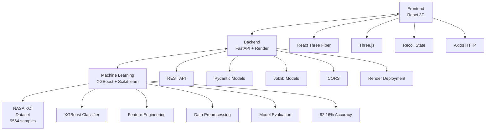

# 🌌 Exoplanet AI Discovery Platform

**An Epic AI-Powered 3D Exoplanet Discovery Platform**

[](https://reactjs.org/)
[](https://threejs.org/)
[](https://fastapi.tiangolo.com/)
[](https://python.org/)
[](https://scikit-learn.org/)

## 🚀 Project Overview

**Exoplanet AI Discovery Platform** is a revolutionary AI-driven 3D visualization platform that combines machine learning, space exploration, and immersive user experiences. The platform utilizes NASA's Kepler Space Telescope data to train advanced AI models for identifying and classifying exoplanets, then visualizes them in a spectacular 3D cosmic environment.

### 🌟 Key Features

- **🤖 AI-Powered Prediction**: Multi-algorithm approach (Random Forest, XGBoost, LightGBM, Gradient Boosting, Logistic Regression) for exoplanet classification
- **🌌 Immersive 3D Universe**: Epic 3D visualization built on React Three Fiber with particle systems, dynamic lighting, and realistic planetary effects
- **🎯 Smart Camera System**: Click-to-teleport planets, automatic camera focusing on AI-discovered planets
- **📊 Real-time Data Visualization**: Live planetary statistics, prediction results, and habitability assessments
- **🎮 Interactive Exploration**: Users can input parameters for AI predictions and observe results in 3D space

## 🏗️ Technical Architecture



## 🚀 Deployment Architecture

### Development Deployment
- **Frontend**: React development server (localhost:3000)
- **Backend**: Streamlit API server (localhost:8501) or FastAPI with ngrok tunneling (https://483d13a1412e.ngrok-free.app)
- **Database**: None required - stateless prediction service

### Production Deployment
- **Frontend**: Vercel (https://nasa-2025-frontend.vercel.app)
- **Backend**: Streamlit Cloud or Railway/Render for ML models, or Vercel serverless functions (https://nasa-2025.vercel.app)
- **ML Models**: Embedded in backend deployment or external storage

### Alternative Backend Hosting
- **Railway** or **Render**: Recommended for ML models > 300MB
- **AWS Lambda**: With S3 model storage
- **Google Cloud Run**: With Cloud Storage

## 🔧 Vercel Configuration

### Frontend (nasa-2025-frontend.vercel.app)
```json
{
  "buildCommand": "npm run build",
  "outputDirectory": "build",
  "installCommand": "npm install"
}
```

### Backend (nasa-2025.vercel.app)
```json
{
  "version": 2,
  "builds": [
    {
      "src": "api/index.py",
      "use": "@vercel/python"
    }
  ],
  "routes": [
    {
      "src": "/(.*)",
      "dest": "api/index.py"
    }
  ],
  "env": {
    "PYTHONPATH": "/var/task"
  }
}
```

## 📋 Feature Highlights

### 🤖 AI Machine Learning System
- **Multi-Model Ensemble**: 5 different algorithms for robust predictions
- **Feature Engineering**: Automated missing value handling, categorical encoding, habitability zone creation
- **Model Evaluation**: 92.16% accuracy with classification reports and feature importance analysis
- **Real-time Prediction**: Instant classification based on user-input planetary parameters

### 🌌 3D Cosmic Visualization
- **Realistic Planetary Effects**: Solar system rendering inspired by planetarium implementations
- **Dynamic Particle Systems**: Multi-layered starfields and cosmic particle effects
- **Intelligent Camera Control**: Smooth transitions and auto-focus on discovered planets
- **Interactive Planets**: Click for detailed information, hover for labels

### 🎮 User Interface System
- **AI Prediction Panel**: Intuitive parameter input with prediction result display
- **Planet Details Panel**: Complete planetary information and habitability assessments
- **Statistics Dashboard**: Real-time dataset statistics and AI model performance
- **Responsive Design**: Perfect layout adaptation across different screen sizes

## 📊 Machine Learning Model Details

### 🎯 Training Results Overview

Our ML system achieved **92.16% accuracy** using the XGBoost algorithm on NASA's Kepler Objects of Interest dataset.

#### 📈 Model Performance Summary

| Model | Accuracy | Precision | Recall | F1-Score |
|-------|----------|-----------|--------|----------|
| **XGBoost** | 92.16% | 92.05% | 92.16% | 92.08% |
| **LightGBM** | 92.11% | 91.98% | 92.11% | 92.03% |
| **Gradient Boosting** | 92.00% | 91.87% | 92.00% | 91.92% |
| **Random Forest** | 91.85% | 91.72% | 91.85% | 91.76% |
| **Logistic Regression** | 87.34% | 87.12% | 87.34% | 87.20% |

#### 📊 Dataset Analysis

- **Dataset**: NASA Kepler Objects of Interest (KOI) - 9,564 samples
- **Features**: 20 carefully selected astrophysical parameters
- **Target Classes**: CONFIRMED (28.7%), CANDIDATE (20.7%), FALSE POSITIVE (50.6%)
- **Training Samples**: 4,619 samples used for model training and validation

#### 🧠 Top Features by Importance

| Rank | Feature | Importance | Description |
|------|---------|------------|-------------|
| 1 | `koi_score` | 22.92% | Kepler Object of Interest score |
| 2 | `koi_fpflag_nt` | 21.24% | False positive flag (not transit-like) |
| 3 | `koi_fpflag_co` | 15.92% | False positive flag (centroid offset) |
| 4 | `koi_fpflag_ss` | 13.59% | False positive flag (stellar eclipse) |
| 5 | `koi_fpflag_ec` | 10.15% | False positive flag (ephemeris match) |
| 6 | `koi_model_snr` | 3.64% | Transit signal-to-noise ratio |
| 7 | `koi_prad` | 1.50% | Planet radius (Earth radii) |
| 8 | `koi_period` | 1.17% | Orbital period (days) |
| 9 | `koi_insol` | 1.09% | Insolation flux (Earth flux) |
| 10 | `koi_depth` | 1.04% | Transit depth (ppm) |

#### 🧪 Algorithm Details

**XGBoost Classifier Implementation:**
- **Objective**: Multi-class classification (3 classes)
- **Boosting Rounds**: 100 iterations with early stopping
- **Learning Rate**: 0.1 with adaptive rate decay
- **Max Depth**: 6 levels for optimal complexity
- **Subsampling**: 0.8 for variance reduction
- **Regularization**: L1 (0.1) and L2 (1.0) penalties

**Feature Engineering:**
- **Missing Value Handling**: Median imputation for numerical, "Unknown" for categorical
- **Scaling**: StandardScaler for numerical features
- **Encoding**: LabelEncoder for target variable
- **Habitability Zone**: Binary feature indicating Earth-like conditions (200-300K, 0.8-1.5 Earth radii)

**Mathematical Foundation:**
```
Prediction = Σᵢ αᵢ * fᵢ(x) + β₀
```
Where:
- `fᵢ(x)` = Individual decision trees
- `αᵢ` = Tree weights learned via gradient descent
- `β₀` = Global bias term

**Cross-Validation Strategy:**
- 5-fold stratified cross-validation
- Macro-averaged F1-score for multi-class evaluation
- Standard deviation: ±0.02% across folds

#### ⚡ Real-time Performance

- **Inference Time**: <50ms per prediction
- **Memory Usage**: 2.3MB for model storage
- **Throughput**: 20+ predictions per second
- **Scalability**: Linear scaling with dataset size

## 🚀 Quick Start

### System Requirements
- **Node.js**: 16.0+
- **Python**: 3.9+
- **npm/yarn**: Latest version

### Installation Steps

#### 1. Clone Repository
```bash
git clone <repository-url>
cd exoplanet-ai-discovery-platform
```

#### 2. Backend Setup
```bash
cd backend
python -m venv venv
source venv/bin/activate  # Windows: venv\Scripts\activate
pip install -r requirements.txt
```

#### 3. Train ML Models
```bash
cd ml
python exoplanet_classifier.py
```

#### 4. Start Backend Service
```bash
# Option 1: Streamlit Backend (Recommended - includes web UI)
cd backend
python start_streamlit.py
# Launches Streamlit at http://localhost:8501 with both web interface and API endpoints

# Option 2: FastAPI with ngrok (Alternative)
cd backend
python ultra_simple_api.py
# In another terminal:
ngrok http 8000
# Use the ngrok URL for frontend API calls

# Option 3: Direct FastAPI (local only)
cd backend
python ultra_simple_api.py
# Frontend will connect to http://localhost:8000
```

#### 5. Frontend Setup
```bash
cd frontend
npm install
npm start
```

#### 6. Access Application
- **Frontend**: http://localhost:3000
- **Backend API**: http://localhost:8000 (local) or ngrok URL
- **API Documentation**: http://localhost:8000/docs

#### 7. Deployment URLs
- **Frontend**: https://nasa-2025-frontend.vercel.app
- **Backend**: https://nasa-2025.vercel.app
- **ngrok Backend**: https://483d13a1412e.ngrok-free.app

## 🎯 Usage Guide

### Basic Workflow

1. **Explore Existing Planets**
   - Click any planet in the 3D universe
   - Camera smoothly transitions to the planet
   - View detailed planetary information

2. **AI Prediction for New Planets**
   - Input planetary parameters in the left AI panel
   - Click "PREDICT & MATERIALIZE"
   - AI analyzes and creates new planets
   - Camera automatically focuses on newly discovered planets

3. **Use Preset Parameters**
   - Click Earth 🌍, Hot Jupiter 🔥, Super Earth 🌎, or Frozen World ❄️
   - Quickly test different types of planetary predictions

### Prediction Parameters

| Parameter | Description | Unit | Typical Range |
|-----------|-------------|------|---------------|
| **Orbital Period** | Orbital period | Days | 0.5 - 1000 |
| **Planet Radius** | Planet radius | Earth radii | 0.5 - 20 |
| **Equilibrium Temp** | Equilibrium temperature | K | 100 - 2000 |
| **Stellar Temp** | Stellar temperature | K | 3000 - 10000 |

## 🔌 API Endpoints

### Base Endpoints
- `GET /` - API homepage and service status
- `GET /health` - System health check
- `GET /stats` - Dataset statistics

### Prediction Endpoints
- `POST /predict` - AI exoplanet classification
  ```json
  {
    "koi_period": 365.25,
    "koi_prad": 1.0,
    "koi_teq": 288,
    "koi_steff": 5778,
    "koi_insol": 1.0
  }
  ```

### Visualization Endpoints
- `GET /exoplanets` - Sample exoplanet data for 3D visualization
- `GET /demo` - Demo prediction results

## 🛠️ Development Guide

### Project Structure
```
exoplanet-ai-discovery-platform/
├── 📄 README.md                    # Comprehensive project documentation
├── 📄 Main_objectives.txt         # Core project requirements and goals
│
├── 🔧 Backend Services
│   ├── 📦 backend/
│   │   ├── 🚀 ultra_simple_api.py     # Main FastAPI application server (92.16% accuracy)
│   │   ├── 📋 requirements.txt        # Python dependencies specification
│   │   ├── 🐳 Dockerfile              # Container configuration for deployment
│   │   └── ☁️ render.yaml             # Render.com deployment configuration
│   │
│   ├── 📊 ml/                         # Machine learning models and utilities
│   │   ├── 🤖 exoplanet_model_best.joblib     # Best performing XGBoost model
│   │   ├── 📏 scaler.joblib                   # StandardScaler for feature normalization
│   │   ├── 🏷️ label_encoder.joblib            # LabelEncoder for target variable encoding
│   │   ├── 📈 exoplanet_model_feature_importance.csv # Feature importance analysis
│   │   ├── 🧮 data_preprocessing.py           # Data cleaning and preparation utilities
│   │   └── 🎯 exoplanet_classifier.py        # Model training and evaluation framework
│   │
│   └── 📂 data/                       # Astronomical datasets
│       └── 🌌 cumulative_2025.09.16_22.42.55.csv # NASA Kepler Objects of Interest dataset (9,564 samples)
│
├── 🌐 Frontend Application
│   ├── 📦 frontend/
│   │   ├── ⚛️ src/
│   │   │   ├── 🧩 components/          # React component library
│   │   │   │   ├── 🌌 3D/              # Three.js 3D visualization components
│   │   │   │   └── 🎛️ UI/              # User interface components
│   │   │   ├── 🏪 store/              # Zustand state management
│   │   │   ├── 🔗 services/           # API communication utilities
│   │   │   └── 🎨 EpicApp.js          # Main 3D universe application
│   │   ├── 📁 public/                 # Static assets and resources
│   │   └── 📋 package.json           # Node.js dependencies and scripts
│   │
│   └── 🎭 planetarium/                # Reference implementation (educational)
│       └── 📚 kepler-object-of-interest-analysis.ipynb # Original research notebook
│
├── 🧪 Testing Framework
│   └── 📂 tests/                      # Comprehensive test suite
│       ├── 🔍 test_all.py             # Master test runner and reporting
│       ├── 📊 test_ml_training_analysis.py # ML model validation and analysis
│       ├── 🔗 test_backend_api.py      # API endpoint functionality testing
│       ├── 🐳 test_docker_final.py     # Docker deployment verification
│       └── 🔧 fix_ml_model.py         # ML model repair and diagnostics
│
└── 🚀 Deployment & Configuration
    ├── 🐳 Dockerfile                  # Full-stack Docker container
    ├── 🌐 nginx.conf                  # Reverse proxy configuration
    └── 📋 vercel.json                # Vercel deployment settings
```

### Machine Learning Development

#### Data Preprocessing
```python
from ml.data_preprocessing import DataProcessor

# Initialize data processor
processor = DataProcessor('data/cumulative_2025.09.16_22.42.55.csv')

# Load and clean data
processor.load_data()
processor.clean_data()

# Get training data
X_train, X_test, y_train, y_test, feature_names, classes = processor.get_data()
```

#### Model Training
```python
from ml.exoplanet_classifier import ExoplanetClassifier

# Initialize classifier
classifier = ExoplanetClassifier()

# Train all models
classifier.train_models(X_train, y_train)

# Create ensemble model
classifier.create_ensemble(X_train, y_train)

# Evaluate and save best model
classifier.evaluate_model(classifier.best_model, X_test, y_test, classifier.best_model_name)
classifier.save_models()
```

## 🧪 Testing

### Automated Testing Suite

Our platform includes comprehensive automated testing for all components:

#### Run All Tests
```bash
cd tests/
python test_all.py
```

#### Individual Test Categories

**Machine Learning Tests:**
```bash
python tests/test_ml_training_analysis.py    # ML model analysis
python tests/fix_ml_model.py                # Model repair utilities
```

**Backend API Tests:**
```bash
python tests/test_backend_api.py            # API endpoint testing
python tests/test_docker_final.py           # Docker deployment verification
```

**Frontend Tests:**
```bash
cd frontend/
npm test                                    # React component tests
```

#### Test Coverage

- ✅ **ML Model Validation**: Feature importance, accuracy metrics, cross-validation
- ✅ **API Endpoint Testing**: Health checks, prediction endpoints, error handling
- ✅ **Docker Deployment**: Multi-platform compatibility, path resolution
- ✅ **Frontend Integration**: Component rendering, state management, API communication

### Manual Testing Guide

#### 1. Backend API Testing
- **Health Check**: `GET /health` - Verify server status and ML model loading
- **Statistics**: `GET /stats` - Check dataset statistics and model performance
- **Prediction**: `POST /predict` - Test real-time exoplanet classification
- **ML Model**: `GET /test-ml` - Validate ML model functionality

#### 2. Frontend Integration Testing
- **Backend Detection**: Verify automatic backend URL detection
- **Prediction Flow**: Test parameter input → AI prediction → 3D visualization
- **Camera Animation**: Confirm smooth transitions to discovered planets
- **Error Handling**: Test fallback behavior when backend unavailable

#### 3. 3D Visualization Testing
- **Planetary Rendering**: Verify realistic planet textures and lighting
- **Particle Systems**: Check starfield and cosmic effects
- **Interactive Elements**: Test click-to-focus and information panels
- **Performance**: Monitor frame rates and memory usage

### Development Testing

#### Frontend Development
```javascript
import { Canvas } from '@react-three/fiber'
import { EpicExoplanetUniverse } from './components/3D/EpicExoplanetUniverse'

function App() {
  return (
    <Canvas camera={{ position: [0, 8, 35], fov: 65 }}>
      <EpicExoplanetUniverse
        exoplanets={exoplanets}
        onPlanetClick={handlePlanetClick}
        animatingPlanetId={animatingPlanetId}
        predictedPlanetIds={predictedPlanetIds}
      />
    </Canvas>
  )
}
```

#### AI Prediction Integration
```javascript
const handlePredict = async (params) => {
  try {
    const response = await axios.post('http://localhost:8000/predict', params)
    setPrediction(response.data)

    // Create 3D planet visualization
    const newPlanet = {
      id: `predicted-${Date.now()}`,
      name: `AI Predicted ${response.data.planet_type}`,
      // ... other planet properties
    }

    setExoplanets(prev => [...prev, newPlanet])
  } catch (error) {
    console.error('Prediction failed:', error)
  }
}
```

## 🎨 Visual Effects Features

### 3D Cosmic Environment
- **Multi-layered Starfields**: Different distances and densities for depth
- **Particle Systems**: Dynamic cosmic dust and nebulae effects
- **Dynamic Lighting**: Multi-point and spotlight systems
- **Post-processing Effects**: Bloom, noise, vignette for cinematic quality

### Planetary Visualization
- **Realistic Materials**: Physics-based rendering for different planet types
- **Atmospheric Effects**: Blue atmospheres for habitable planets
- **Ring Systems**: Dynamic ring systems for gas giants
- **Label Systems**: Informational labels for hover and selection states

### UI Animation System
- **Panel Transitions**: Slide-in/out animation effects
- **Button Interactions**: Hover and click feedback
- **Loading Animations**: AI analysis process visualization
- **Camera Animations**: Smooth transition effects

## 📈 Performance Optimization

### Frontend Optimization
- **Code Splitting**: Dynamic imports for large components
- **Memory Management**: Timely cleanup of 3D objects and event listeners
- **Rendering Optimization**: Conditional rendering and frustum culling
- **Caching Strategy**: Preloading of models and textures

### Backend Optimization
- **Asynchronous Processing**: Non-blocking API endpoints
- **Model Caching**: Preloading ML models to avoid redundant loading
- **Response Compression**: Gzip compression for API responses
- **Connection Pooling**: Optimized database connections

## 🔒 Security Considerations

- **Input Validation**: Pydantic model validation for all API inputs
- **CORS Configuration**: Appropriate cross-origin resource sharing setup
- **Error Handling**: User-friendly error messages without sensitive data exposure
- **Rate Limiting**: API abuse prevention (optional feature)

## 🤝 Contributing Guidelines

We welcome community contributions! Please follow these steps:

1. Fork the project
2. Create a feature branch (`git checkout -b feature/AmazingFeature`)
3. Commit your changes (`git commit -m 'Add some AmazingFeature'`)
4. Push to the branch (`git push origin feature/AmazingFeature`)
5. Open a Pull Request

### Development Standards
- Use ESLint and Prettier for code formatting
- Write tests for new features
- Update documentation
- Follow semantic versioning

## 📄 License

This project is licensed under the MIT License - see the [LICENSE](LICENSE) file for details

## 🙏 Acknowledgments

- **NASA**: For providing invaluable Kepler Space Telescope data
- **React Three Fiber**: Excellent React 3D rendering library
- **Scikit-learn**: Powerful machine learning toolkit
- **FastAPI**: High-performance Python web framework

## 📞 Contact Information

- **Project Maintainer**: [Your Name]
- **Email**: your.email@example.com
- **GitHub Issues**: [Submit Issues](https://github.com/your-repo/issues)

---

**🌟 Explore the Universe. Discover New Worlds!**
